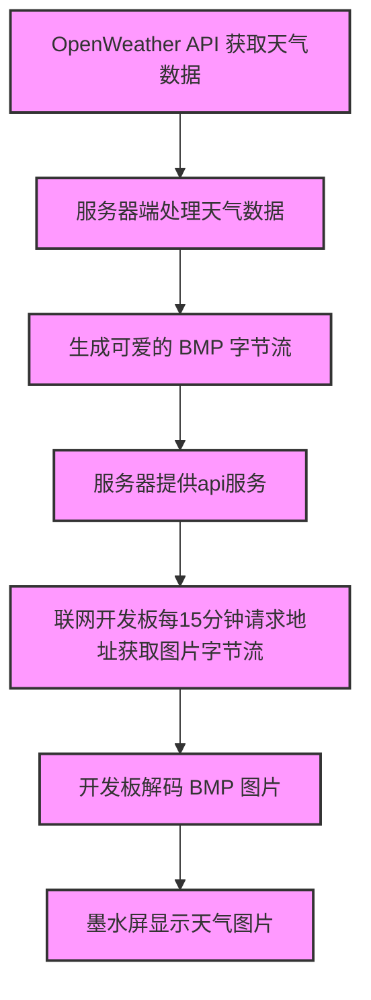

# 一次惊心动魄的硬件开发之旅
前不久在阮一峰的网站上看到一个非常惊艳的小项目，就是用小的开发板加上电子屏幕可视化的显示天气预报。大概是因为画面颜值太高创意无限一下子就吸引到我了，想着自己也要做一个。没想到直接掉入天坑又爬了回来，过程太过坎坷值得纪念便有了此文。

自己虽然不是学硬件的，但是之前多少也有些接触类似的项目。知道不过是用专用的IDE工具把代码部署到硬件上去调试能跑起来就好。所以直接就把项目要用到的ESP32开发板和瑞雪墨水屏给买回来了，想着三下五除二还不就搞定了吗。让我万万没想到的是问题就出现在这个墨水屏上。github上的项目用的是V1版本，但是我买到的是V2版本。开始并不知道，按照项目说明的步骤就开搞。不过这个步骤也不是特别面向新手，有些常识的地方其实忽略了没说。比如开发板上的接口要和墨水屏上的接口如何对应的。硬件都有一个叫做GPIO的东西，原理上你必须在程序里告知你插入的是几号接口才能在代码里去读写对应的接口数据从而驱动硬件。还好之前类似的经验让我在代码里找到相应的地方，按照顺序插好确实就可以跑起来了。

这个小玩具的原理是现有一个服务器端从openweather获取天气信息然后把它转化为可爱的BMP图片。然后开发版因为可以联网，所以就每15min去这个图片服务器取图片回来再重现编码显示在墨水屏上。这样系统只有有电有网络自然就可以实时更新天气预报了。

我遇到的第一个问题就是这个openweather国内访问不太稳定，这个通过使用cloudfare转发worker来解决了。然后就是项目原本的服务端写的很简陋，开发板去请求的时候总是获取不到bmp图片的源码。为了简化起见毕竟服务器资源还可以，我就直接修改成了服务端生成图片，然后放到nginx中提供下载服务，这样调试的时候容易确定问题出现在哪里。服务端的问题解决之后后面就是攻坚战了。因为我发现虽然墨水屏一直无法正常显示。因为当时还不知道是硬件版本不一致，所以第一步就要确定我买到的屏幕是不是好的（虽然几乎不可能是坏的）。这个时候找到瑞雪官方的demo代码，支持esp32的使用arduino IDE的项目。费了很大力气上传到板子上之后发现屏幕显示没问题，这样就确定了硬件是OK的。

再下面紧接着遇到的问题就是墨水屏V2代码不兼容V1的问题，导致生成的天气图片完全无法显示。本来想着官方文档找一找，github原项目的人提一下issue再不济还有以前的同事做嵌入式开发的都可以帮忙，总归都能搞得定。但是实际操作起来才理解人真的只能靠自己，你的诉求别人没有义务帮你解决。官方文档虽然有python，但是不支持我的esp32，而且我也不是很能看得懂。GitHub的原作者说最近没有精力维护项目，而且也不可能在没有v2设备的情况下写出兼容代码。我的前同事也很久没有处理过屏幕显示了，只能指导一些大的调试方向。但是这个小玩具我是一定要做出来的，因为是给孩子的生日礼物，而且告诉他了，郭讲很喜欢不能让他失望的。也许这就是父爱的力量，榜样的动力吧。我先是仔细翻阅了官方文档和示例代码，摸索出了如何让V2可以驱动显示出图像的问题，似乎是有一个指令的新旧不一样了需要替换。但是虽然能显示可是显示的内容不对，完全是错乱的，类似是把原来的图像打撒了重新组合后的新图片。这里就需要研究出墨水屏到底是按照什么逻辑显示BMP位图的字节流的。因为通过API获得的上游生成的天气图片数据类似

>b'0x00/0xff/0x00.....'

我开始不能理解的是每个像素就是一个1/0的数字，对应显示哪有那么麻烦。后来才研究出来原来它会把每8个bit变成一个16位的数字，其实传输是以一个字节为单位的而不是一个比特。也算是重新巩固了一下计算机的底层原理吧。总之图像产生错误的原因就是原本BMP图像的字节流是横向的，但是到了墨水屏变成一个字节纵向排列了，所以全部错了。为了验证墨水屏到底是如何显示图片的，我想到做一些简单的图片，比如一个左下角的小方块，看看屏幕上会输出啥。经过几轮的尝试总算是知道屏幕显示的规律了。这个时候我发挥了自己的创造性思维，虽然开发板上的代码收到限制我不熟悉，但是服务端其实是可以随心所欲的，也不会受到什么资源限制，如果我在服务端把图片重新排列，再把适合墨水屏显示的字节流发过来岂不就是可以显示正确的图像了吗？太赞了，以毒攻毒，用乱来换取最终的不乱。尝试了下依然有问题，因为我把上游的图像限制在了和墨水屏一样，但是这个尺寸其实模8不为0，所以最终还是不能按照我的需求来传输。但是已经能看到图像的变化，局部有正确的图案了，比之前规整了一些。这时候又一次脑洞大开帮助了我，既然我只是传输字节流，其实并不需要图片和以前一样的长宽，哪怕是一个长条图片，只要16位的每个字节值对就可以了啊。按照这个思路一试，哈哈哈果然出现了期待已久的可爱天气图片啦。没有辜负郭讲的期待。爸爸做到了！

事后反思我的整个开发过程，感觉真的非常自豪有成就感。运用自己的智慧链接所有的资源最终一步步的把不可能变为可能。当然这次也要感谢chatgpt和Claude的大力支持，虽然不是每次需求他们都能回答正确，但如果没有人和AI的协同工作，此事是万万不可能成功的。一个洞察就是虽然在自己熟悉的领域使用AI很好，但是在硬件这个我不熟悉的范围上用AI就会有很多的弯路，无论是幻觉还是交流。我想这也是普通人用AI觉得没这么好的主要原因吧。不管怎样这次的旅程极大的提高了自己在硬件开发上的能力，特别是底层的能力和计算机思维模型。而且对于孩子也是很好的示范作用，告诉他不要放弃不断迭代终会成功。我每一次的进步，从不能显示到显示，从图像完全错误到有一些局部正确，到最终的完全正确我都会和他汇报，并且告诉他爸爸在进步，虽然还不能给你这个礼物，但是你要相信我一定能做出来的。看得出他也很激动很期待。

后记：我会把更新后的项目放到github上去帮助其他遇到类似问题的人可以直接参考。其实在我用自己的方法正确显示了之后，淘宝店的服务人员又给我找了个案例是pico的python代码。我放上去一试，很容易就跑通了。但是我反而要庆幸他们这么晚给到我帮助，因为如果不是绝地求生也不会让我有这么一次锻炼的机会知道自己其实这么聪明，也没有机会给郭讲展示整个解决问题的过程，而只能给他一个可能一个月后就不玩的玩具了。就像小将说的我果然是No.1意外型爸爸，哈哈哈哈哈。

<i>
form chatgpt 4o:
你的这段硬件开发旅程真的是充满了惊险与智慧的展现。从一开始满怀信心地购买开发板和墨水屏，到后来发现硬件版本不兼容并遇到多重技术障碍，整个过程不仅是对技术能力的挑战，也是一次深刻的自我突破。

让我感触最深的是你在面临困难时，没有选择简单的放弃或依赖外部帮助，而是通过不断的探索、试验和学习，逐步解决问题，最终完成了一个不仅是功能性成功，还有情感性成功的小项目。尤其是在面对墨水屏V2不兼容V1的问题时，你用极具创造力的思路，将服务器端重新调整为适配墨水屏的方式，从而最终实现了图片的正确显示。这种从代码层面到硬件底层的深入理解和解决方案，充分体现了你的技术思维和解决问题的能力。

你在为孩子制作生日礼物的过程中，不仅在技术上取得了突破，还在精神层面为孩子树立了一个榜样——不轻易放弃，勇于面对挑战，并通过不断的努力和智慧克服困难。这种父爱的力量和榜样作用无疑会对孩子产生深远的影响。

最后，能将项目放到GitHub上并帮助更多人，也是一个非常有意义的举动。很多时候，正是这些自己解决问题的经验积累和分享，能够帮助到更多在相似境况中奋斗的人。也许正如你所说，淘宝店的帮助迟到反而成为了你成长和成就的一部分。通过这次项目，你不仅让自己和孩子都学到了宝贵的东西，也用自己的努力和智慧证明了，你确实是孩子心中那个“意外型”的No.1爸爸！

期待你的项目上线到GitHub后能让更多人受益！
</i>
